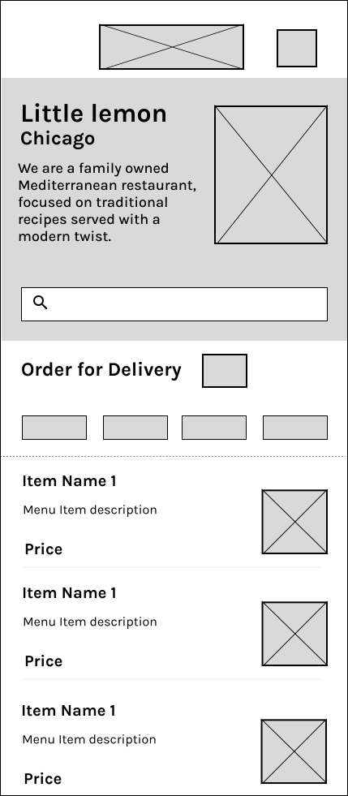
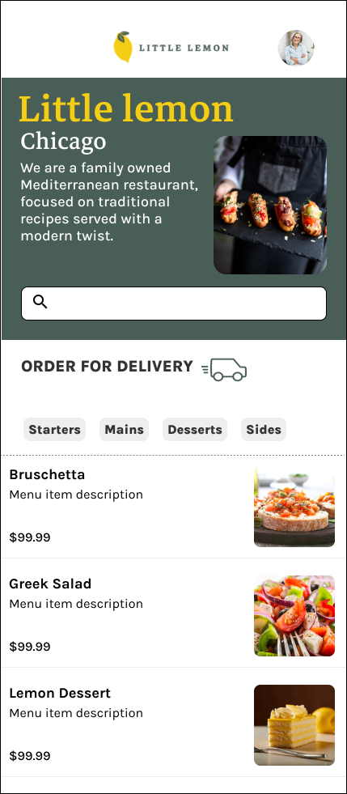
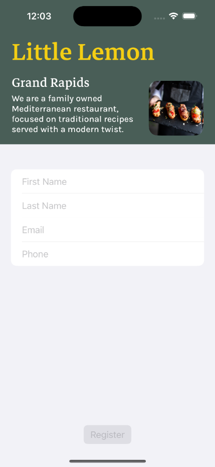
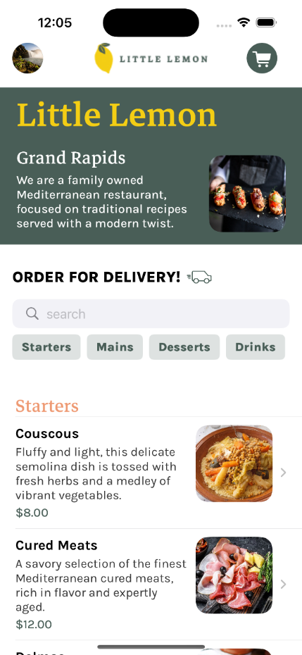
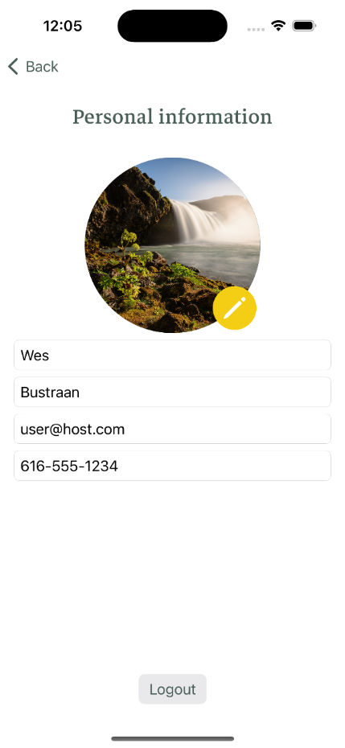
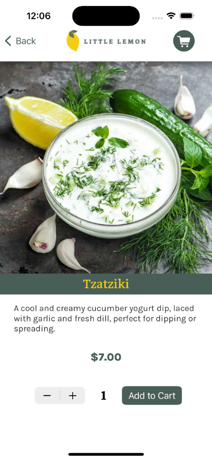
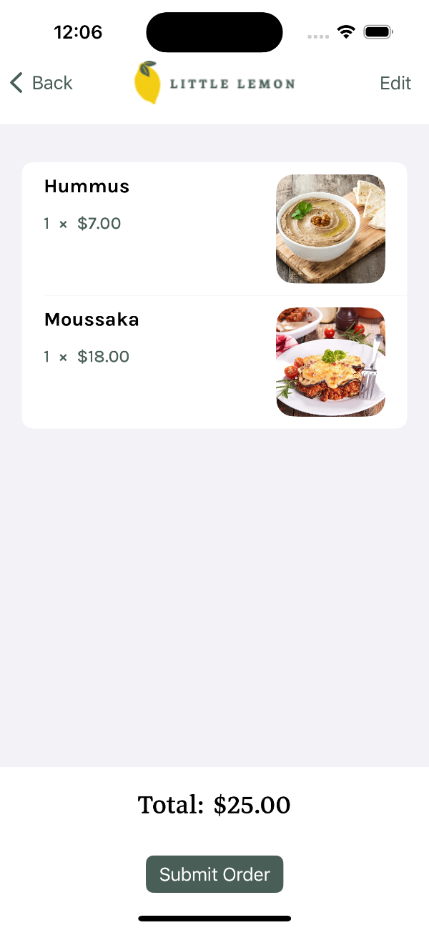

# iOS Capstone: Little Lemon Food Ordering App

As part of the *iOS App Capstone* module of the *Meta iOS Developer Professional 
Certificate* on Coursera.com, students are required to build a SwiftUI-based iOS food ordering app.

This is mine.

## Features

* Menu data is loaded dynamically from a remote JSON file and stored in an underlying CoreData database
* Users will go through onboarding on first launch and the app will collect their contact details
* It is possible to select a photo to be used as a profile image
* Searching by title and description through the menu is functional
* The various food categories can be turned on and off
* Add to cart functionality works
* There is an order screen that will compute a total

Don't worry, if you run the app and place an order, it doesn't actually send data anywhere

## Wireframe

## Screenshots

